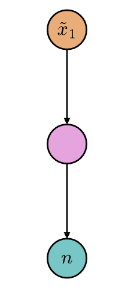
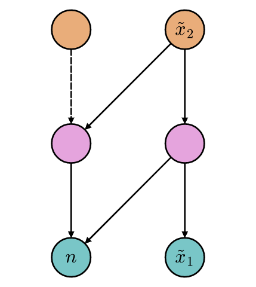
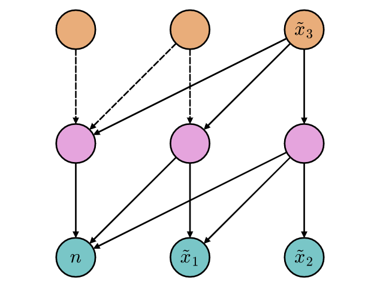
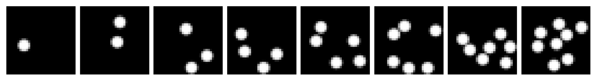
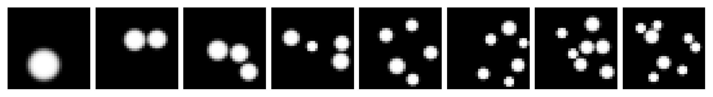

# Learning Numerosity Representations with Transformers

This repository contains the source code used to produce the results presented in *"[Learning Numerosity Representations with Transformers](https://www.preprints.org/manuscript/202105.0401/v1)"*. The work shows that attention-based architectures operating at the pixel level can learn to produce well-formed images approximately containing a specific number of items, even when the target numerosity is not present in the training distribution. The Figure below reports 3 example attention graphs describing the *spontaneous generation* (from left to right) of a novel image.



## Requirements

The Python packages required to execute the code are listed in ```requirements.txt```.

## Datasets

Run the following command to generate the *Uniform Dots* dataset:

```python ud_generation.py --dir root --res 32 --frames 1 --samples 18000 --r 0.9 --add_num```



Run the command below, instead, to generate the *Non-Uniform Dots* dataset:

```python nud_generation.py --dir root --frames 1 --samples 18000 --add_num```



By modifying command-line arguments and script constants, it is possible to generate custom dataset instances.

## Training

The available models can be trained by typing ```python training.py``` in the terminal. Again, use arguments and constants to customize the training procedure.

## Experiments

The experiments reported in the cited paper can be found in the ```evaluation.ipynb``` notebook.

## Citation (temporary)

Boccato, T.; Testolin, A.; Zorzi, M. Learning Numerosity Representations with Transformers. *Preprints* **2021**, 2021050401 (doi: 10.20944/preprints202105.0401.v1).

---

**DISCLAIMER**

The published repository is experimental and has been exploited for academic research activities. The used nomenclature may slightly differ from the reference paper. The authors assume no responsibility for future deployments of the shared code.

---
